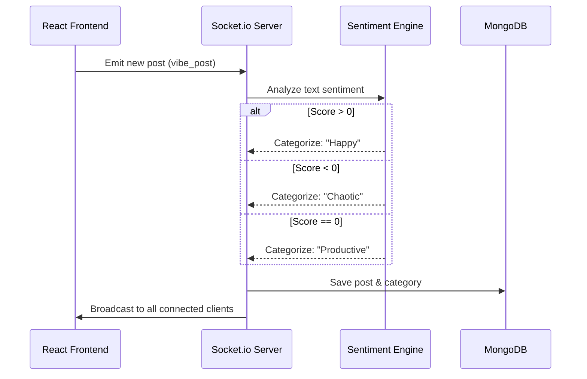

# VibeCheck (AI Sentiment Dashboard)

A modern, real-time social sentiment dashboard built on the MERN stack. VibeCheck leverages AI-driven Natural Language Processing (NLP) to instantly analyze user interactions and categorize them into emotional "Vibes," creating a live pulse of the community.

## 🎯 Purpose
To move beyond basic CRUD applications by implementing WebSockets (Socket.io) for real-time bidirectional communication, coupled with a server-side AI sentiment analysis pipeline that acts on data before broadcasting it.

## 📸 Architecture & Workflow



## ✨ Features
*   **Real-Time Feed**: Powered by `socket.io`, posts appear instantly across all connected clients without requiring a page refresh.
*   **Live Sentiment Analysis**: Automatic categorization of posts using the `sentiment` NLP package, scoring text data to deduce the user's emotional state (Happy, Productive, Chaotic).
*   **Vibe Filtering**: Users can filter their feed experience based on the community's current emotional current.
*   **Robust MERN Architecture**: Clean microservice-style separation between the Node.js/Express backend (with Mongoose) and the Vite-powered React frontend.

## 💻 Code Style Note
*This codebase intentionally utilizes an informal, multilingual "weird code" style for internal variable naming (e.g., `thikthak` for HTTP server, `aso_bhoi` for DB connection). The underlying implementation strictly adheres to modern asynchronous JavaScript and WebSocket patterns.*

## ⚙️ Setup & Installation

### Prerequisites
*   Node.js (v18+)
*   MongoDB (running locally or a MongoDB Atlas URI)

### 1. Clone the repository
```bash
git clone https://github.com/12345Shahid/VibeCheck.git
cd VibeCheck
```

### 2. Setup Backend (Server)
```bash
cd server
npm install
```
Create a `.env` file in the `server` directory and add your MongoDB connection string:
```env
MONGODB_URI=mongodb://localhost:27017/vibecheck
PORT=5001
```
Start the server:
```bash
npm start
```

### 3. Setup Frontend (Client)
Open a new terminal window:
```bash
cd client
npm install
npm run dev
```
*(The UI will be accessible at `http://localhost:5173`)*

---
*Created by [Shahid](https://github.com/12345Shahid)*
